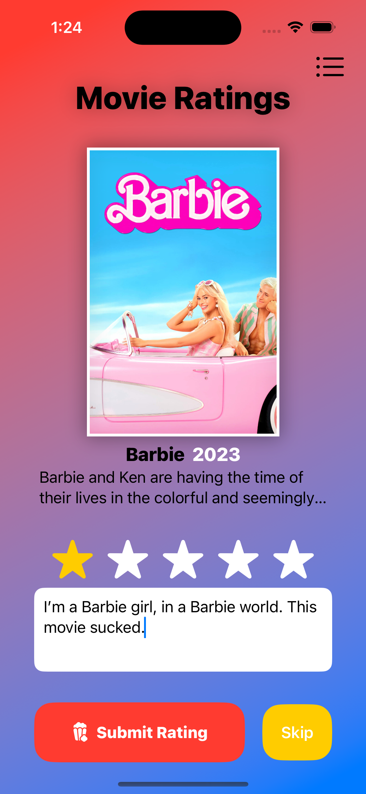
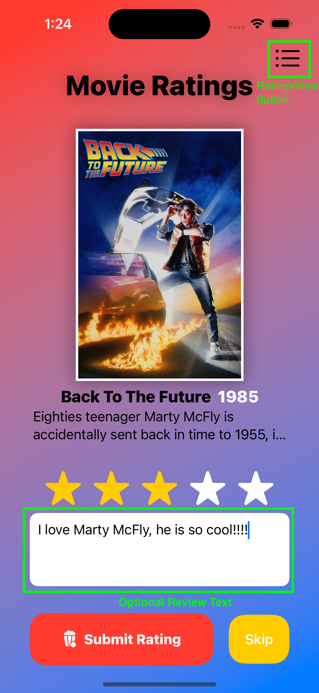
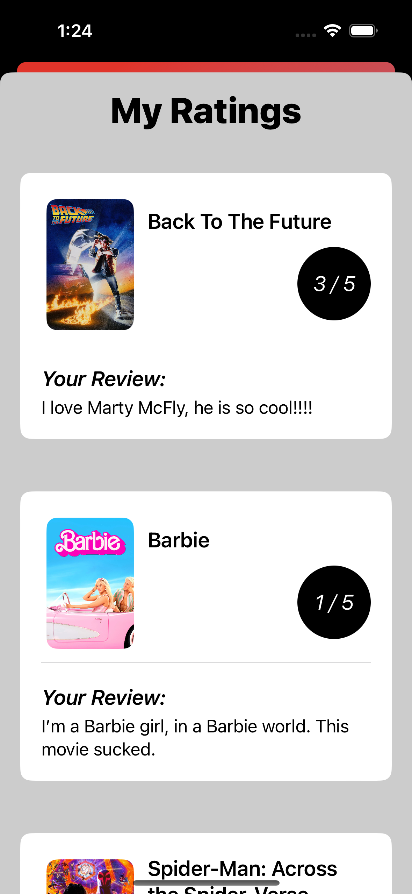
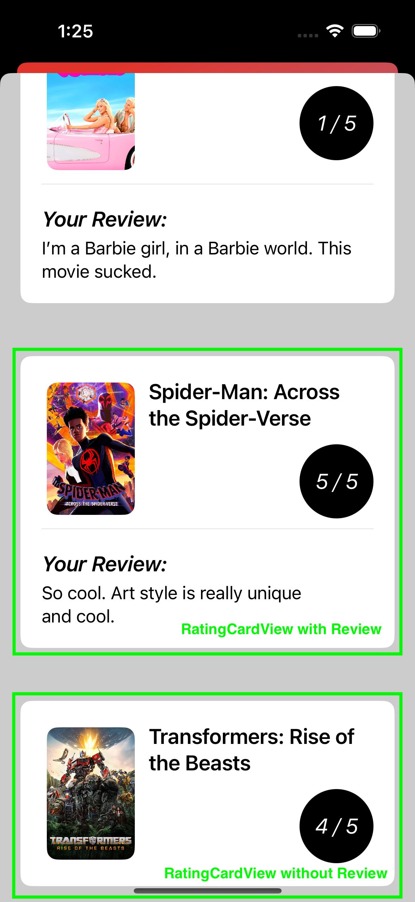

# Module 6: Movies Rating App with SwiftUI

In this module, you'll be building an app to rate movies using SwiftUI.

#### What you'll accomplish:

- [ ] Share and manage view-wide state using SwiftUI property wrappers.

- [ ] Build nested views by decomposing the different layers into subviews.

- [ ] Learn basic methods of navigation, such as a “sheet.”

#### Files Included

- `MoviesView.swift`
- `RatingsView.swift`
- `RatingCardView.swift`
- `Movie.swift`
- Relevant images found within `Assets.xcassets`

#### App Screenshots
- There are 4 images included that show what your implementation should look like. Those can be found under the `UI_Screenshots` folder.
- You should follow this design as precisely as possible.
- Take note of the green annotations made on the images, as they give insight on the functionality and design features.
- The app icons used in the provided screenshots are available within SwiftUI's library. You do not need to download them. Download Apple's "SF Symbols" application, which provides you with the alias names for all Apple icons.

#### General Steps
1. `Movie.swift` Familiarize yourself with the structure of the Movie model and add at least 
    one movie of your choice to the static “allMovies” property.
2. `MoviesView.swift` Write the declaration/initialization code for instance variables.
3. `MoviesView.swift` Using the app screenshots as a guide, recreate the frontend of ContentView within the 
“body” variable. (Do not worry about functionality at this step.)
4. `MoviesView.swift` Implement two functions “getNextMovie” and “submitRating.”
5. `MoviesView.swift` Implement the navigation to RatingsView by adding a sheet to the outermost View container.
    Also make sure to pass state appropriately.
6. `RatingCardView.swift` Write the declaration code for instance variables and recreate frontend of a rating card.
7. `RatingsView.swift` Write the frontend for RatingsView by instantiating a “RatingCardView” for each rating.

## Getting Started

- Fork then clone the repo on to your local device
    - Cloning can be done via Xcode or the command line
- Build the project via Xcode (`Cmd+b`) to make sure everything is loaded properly.
- There should be no errors and you should be able to see the previews on each screen.
    - If for some reason you can't get previews working, run the app in the
      simulator instead

## Step 0: Understanding the Movie model

In general terms, any struct or class that holds data representing some abstraction is referred to as a **model**. When building iOS apps, you will definitely have to represent things in terms of models.

We use a struct here because it gives us enough functionality to represent our Movies. One advantage is that structs don't use dynamic memory like classes, since they are immutable in behavior. Understanding the workings of immutability are important when working with structs.

Immutability means that manipulating a struct's instance variable prompts the replacement of that struct instance with a new struct instance reflecting the variable manipulation, rather than manipulating the struct instance directly. Thus, it's immutable in the sense that the same exact struct instance is never manipulated. 

As you can see, Movie conforms to the Identifiable protocol. This is because each Movie instance is distinct from another, and SwiftUI's ForEach requires array elements to conform to the Identifiable protocol.

Instance variables:
- `id`: some unique identifier generated randomly upon instantiating a Movie object. You will want to use this when specifying the id parameter of a certain UI component (hint: 'for each').
- `title`: the title of the Movie
- `year`: the year the movie was published
- `description`: short summary of the movie
- `image`: the image file's name. You can use this value directly to prompt an Assets.xcassets lookup with SwiftUI. Look into how you can 'display images from Assets.xcassets using SwiftUI". Helpful to know early on.
- `rating`: an Optional Int between 1 and 5. When this variable is nil, it implies that no rating has been provided.
- `myReview`: an Optional String representing the review text for this movie. When this variable is nil, no written review has been provided - be sure to handle the empty string edge case.

## Step 1: MoviesView State & Logic

Before building the above view, think about the state variables you may need to manage this view. You may need some state to manage view presentation, others to change active data, etc. 

A few considerations:
- You may want to create a stateful copy of the movies collection found in `Movie.allMovies`. This is because `Movie.allMovies` is stored as a constant.
- You'll also be manipulating the `Movie` objects to add ratings and reviews. As we mentioned, any such manipulation of a `struct` replaces the object with a fresh new object reflecting the manipulation. Because of this, you'll want to statefully track the active Movie displayed (Barbie in this case) as an index of the array, not the movie object itself.

The text field implementation can be done in two ways. You'll probably need a state variable that holds the state of the text field as discussed in lessons.
- The simple approach is to propagate the rating and text field state to the object in the array upon clicking submit.
- This is the more difficult implementation. Think about how you can **immediately** reflect every change from the text field's state in the active movie's object (HINT: `.onChange(...)` view modifier will be helpful).

After determining the state you will need, implement the `getNextMovie()` and `submitRating()` functions of MoviesView. You will use these two functions within each button to jump to the next movie in the list and update the movie's rating/reviews, respectively.

- [x] Share and manage view-wide state using SwiftUI property wrappers.

## Step 2: Building MoviesView

 

- The rating feature has to work such that if you click on star X, star X and all the stars before it must be filled with yellow.
- The submit rating button will use the provided review input and rating to update the movie's data. It then moves on to the next movie.
- The skip button will ignore the provided rating and review, then just move on to the next movie.
- The top right button serves as a means to navigate to the My Ratings screen as a `popover`. You can leave the action stub for this button empty, for now.
- The popcorn icon is not available in the SF Symbols library. Find some custom popcorn icon online, and integrate it into the application.

## Step 3: Building RatingsView

We've modularized this such that you would design the rating cards in a separate file (namely `RatingCardView`). You will use your implementation of `RatingCardView` to display the cards within `RatingsView`. Think about the input data you may want to take within this view. No state will need to be managed in `RatingCardView` or `RatingsView` as the screen is not interactive.

- [x] Build nested views by decomposing the different layers into subviews.

## Step 3: Building RatingsView
 

You should have completed all the views at this point. To conclude, set up a sheet navigation that redirects the user to `RatingsView` upon clicking the RatingsView button. Pass the appropriate data. You will have to do your own research to implement this feature. Look into the SwiftUI `.sheet(...)` view modifier. It conditionally presents a view popover.

- [x] Learn basic methods of navigation, such as a “navigation sheet.”

## Conclusion

Now try running the app in the simulator.

#### What you've accomplished today:

- [x] Share and manage view-wide state using SwiftUI property wrappers.

- [x] Build nested views by decomposing the different layers into subviews.

- [x] Learn basic methods of navigation, such as a “sheet.”

